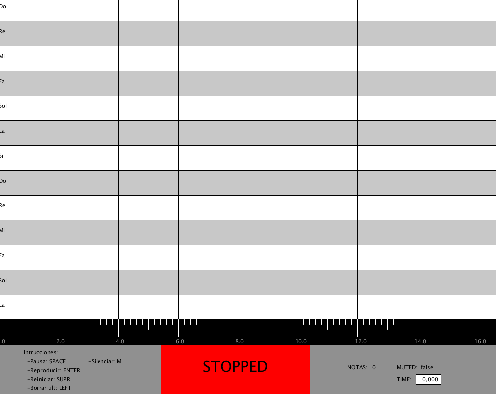

# SoundProcessing

## Autor

Héctor Henríquez Cabrera

Correo: [hector.henriquez101@alu.ulpgc.es](mailto:hector.henriquez101@alu.ulpgc.es)

Asignatura: Creando Interfaces de Usuario (CIU)

## Introducción

En esta séptima práctica se ha compuesto una aplicación mediante **processing 3**. Se ha creado una aplicación en la que se trata la manipulación del sonido. La aplicación básicamente da la posibilidad de componer música mediante una 'partitura' en la que se dibuja nota a nota y luego reproduciéndolas. 

## Demo

En la demo se puede apreciar la creación y reproducción de una partitura. Además en la reproducción se muestra la utilización de todos los controles.

## Implementación

### Librerías

Para la implementación de esta aplicación no se ha usado **GifAnimation**. Además se ha usado las librerías de **Minim** mencionada en el guion de prácticas para la implementación de los sonidos como si fuesen un instrumento.

### Diseño

Para el diseño de esta aplicación se opto por añadir la menor  cantidad  de elementos que dificultasen la visualización del sistema,  solo teniendo texto mostrando los datos para la correcta utilización de la aplicación.

### Funcionalidades

Las funcionalidades básicas añadidas en esta práctica han sido la implementación de todos los menús que muestran información, pausar la reproducción y editar la secuencia que se va a reproducir.

## Controles

Todas las interrupciones manejadas en este programa han sido mediante teclado, por lo que se han manejado las interrupciones generadas  mediante la función **keyPressed** y **mousePressed**. Las teclas y acciones consecuentes que las activan son:

| Tecla | Uso                                          |
| ----- | -------------------------------------------- |
| SPACE | Pausar o continuar una reproducción en curso |
| ENTER | Empezar o Parar una reproducción             |
| SUPR  | Eliminar todas las notas de la partitura     |
| LEFT  | Elimina la última nota añadida               |
| m     | Mutea o desmutea el sonido de la aplicación  |

## 

## Bibliografía

[Guion de prácticas](https://cv-aep.ulpgc.es/cv/ulpgctp20/pluginfile.php/126724/mod_resource/content/22/CIU_Pr_cticas.pdf)

[processing.org](https://processing.org/)